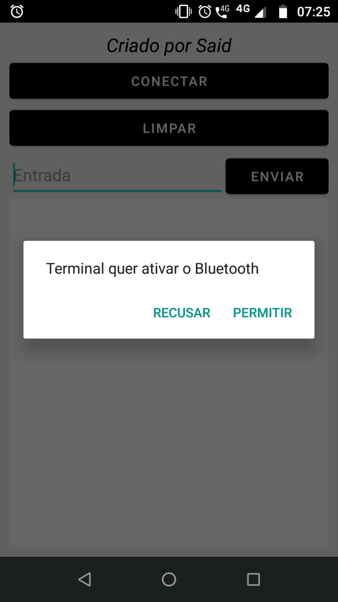
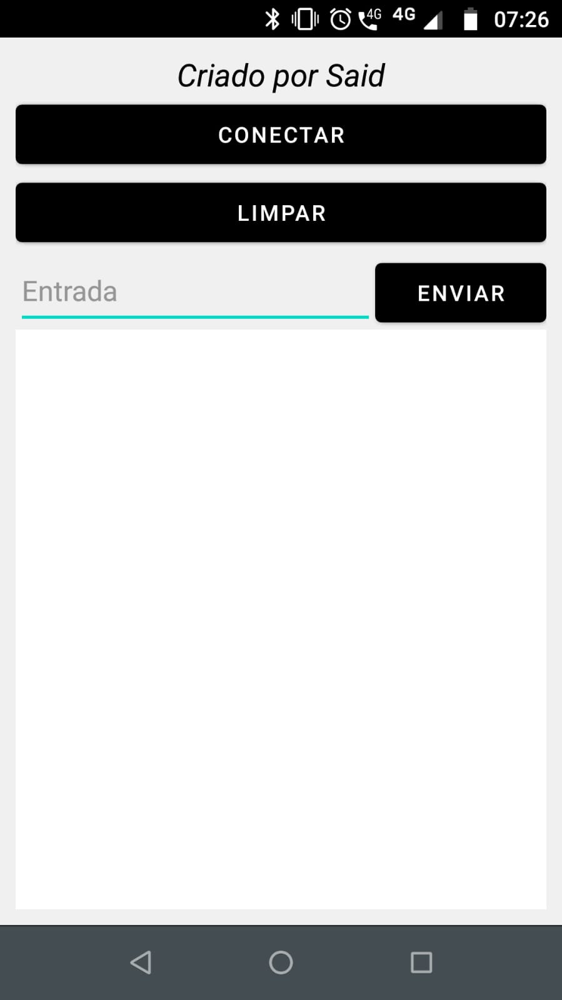
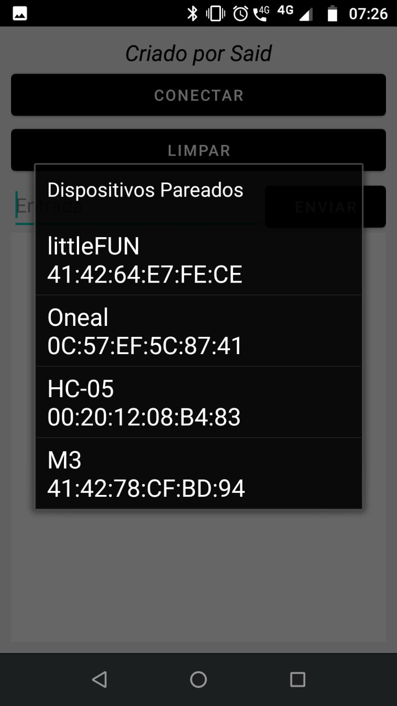
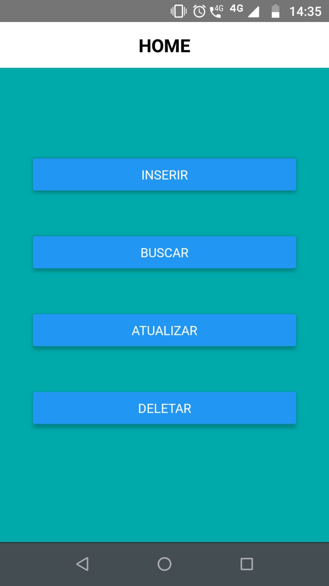
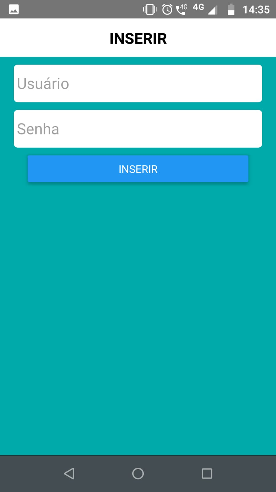
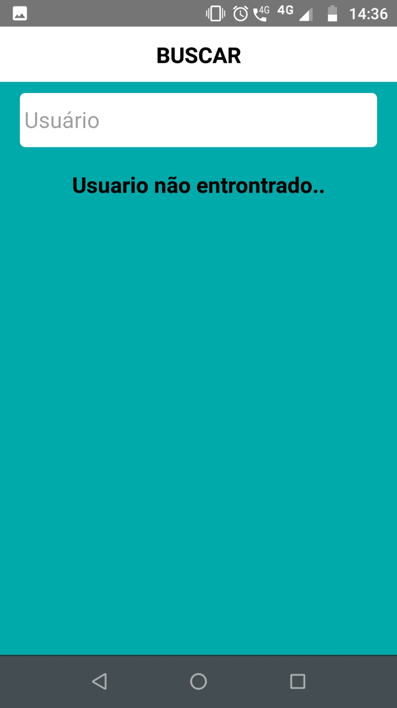
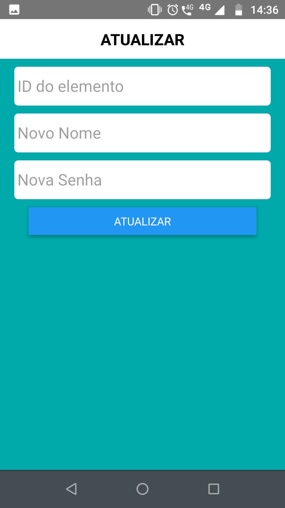
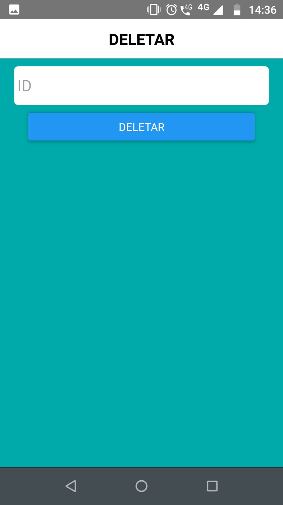

# android-projects
Some personal Android development projects

## Android Studio and Java

Terminal is an app that connects Arduino and the bluetooth module, very useful for debugging.
  

#### Download: [terminal](https://drive.google.com/file/d/1sN1lQLeLn6wgx71HiJeYXv_0z7GN36wQ/view?usp=share_link)

Baladinha is an app that makes a bluetooth connection with the arduino and simulates the intensity of music with LEDs
#### Download: [baladinha](https://drive.google.com/file/d/1IQTQwcZPgGq2Z-8YF8meXiJ26PnBX_9E/view?usp=share_link)

Bluetooth is the basic app for bluetooth connection with Arduino, it can be used as a base project
####  Download: [bluetooth](https://drive.google.com/file/d/1G4wRkkpO4LKGhiQBfpKXWltF4swVy7kB/view?usp=share_link)

Download Manager Example the name is self-explanatory
#### Download: [download-manager-example](https://drive.google.com/file/d/1BILz0QPOw_cHXhTQwTOXtzxuwfhcnjKk/view?usp=share_link)

## React Native

BDApp is an app for connecting to a database using an API made for a selection process. This application uses an API hosted on an online server, currently the server is no longer online (sorry) so if you want to test it, you will need to create your API and replace the source code link.
  

#### Download: [DBApp](https://drive.google.com/file/d/1UhOc33-3nh8pYZStQR-VCgBOXunPYCUE/view?usp=share_link)
